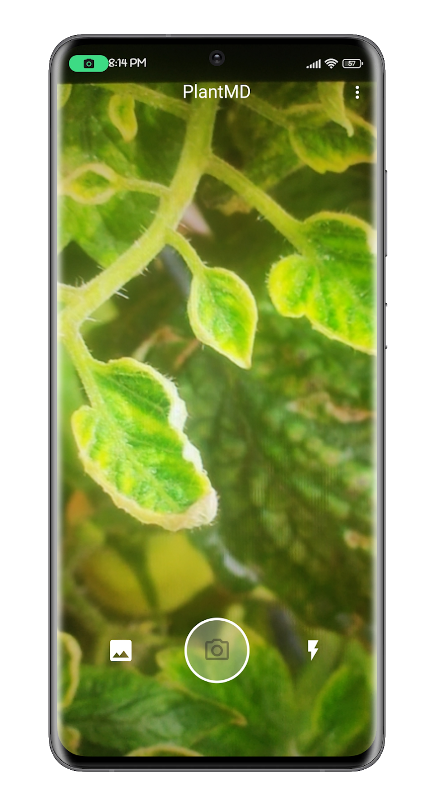
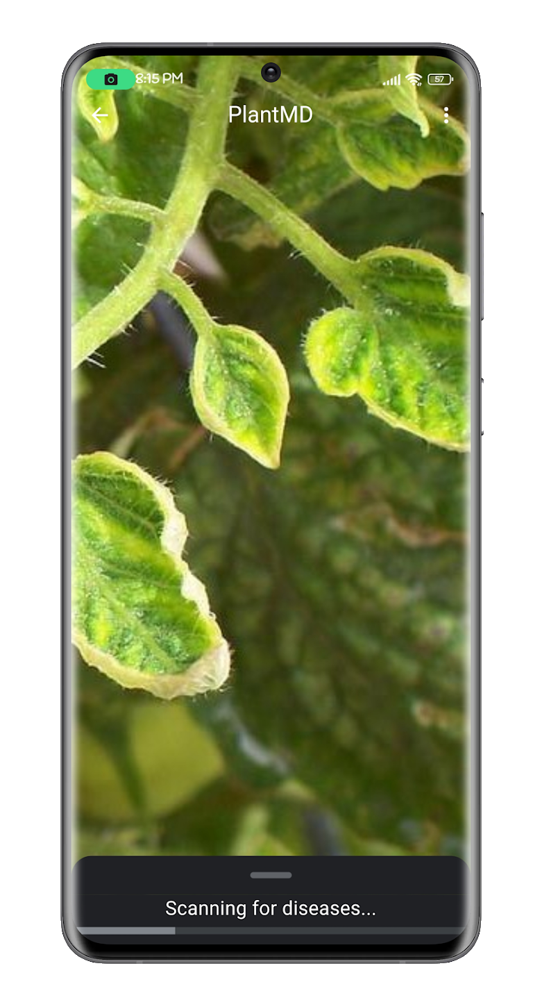
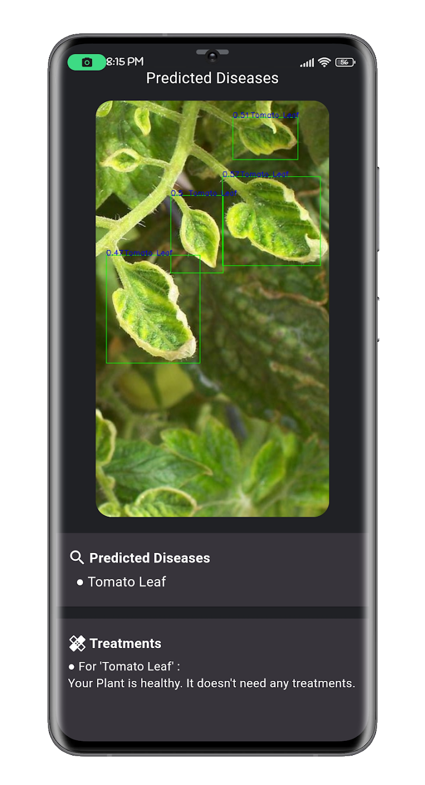

# PlantMD
PlantMD: A Plant Disease Prediction System

## App Screenshots

    
    
    

## Repositories
Web API Repo: [PlantMD-WebApi](https://github.com/anuraglimbu/PlantMD-WebApi)  
Flutter Client Repo: Opensourcing Soon.....